# 基于springboot的靓车汽车销售网站

---
### 👉作者QQ ：1556708905 微信：zheng0123Long (支持定制修改、部署调试、定制毕设)

### 👉接网站建设、小程序、H5、APP、各种系统等

---

#### 介绍

我开发了一个基于SpringBoot的靓车汽车销售网站，该系统旨在提供一个在线平台，用户可以方便地浏览和购买各类汽车。系统设计了两种角色，分别是管理员角色和用户角色，以满足不同用户的需求。管理员角色主要负责网站的管理和维护，包括车辆展示、品牌和型号管理、维修材料管理等；用户角色则专注于浏览车辆信息、获取汽车资讯、进行留言反馈和购物等。系统通过精细的角色分工和功能模块设计，提升了用户的使用体验和网站的管理效率。

#### 技术栈

后端技术栈：Springboot+Mysql+Maven

前端技术栈：Vue+Html+Css+Javascript+ElementUI

开发工具：Idea+Vscode+Navicate

#### 系统功能介绍

管理员角色  

个人中心：管理员可以在个人中心查看和编辑个人信息，包括修改密码和更新联系方式。  
用户管理：管理注册用户的信息，包括添加、删除和编辑用户数据。  
车辆展示管理：管理网站上展示的车辆信息，包括新增、编辑和删除车辆展示内容。  
车辆品牌管理：管理车辆品牌信息，包括新增、编辑和删除品牌信息。  
车辆型号管理：管理车辆型号信息，确保展示的车辆信息完整和准确。  
维修材料管理：管理汽车维修所需的材料，包括材料的新增、编辑和删除。  
材料分类管理：对维修材料进行分类管理，方便管理员和用户查找。  
用户交流：管理员可以参与用户交流，回答用户的问题和反馈。  
留言板管理：管理用户在留言板上的反馈和留言，及时处理用户的意见和建议。  
系统管理：进行系统设置和维护，确保系统的稳定运行。  
订单管理：管理用户的订单信息，包括订单的审核、处理和跟踪。  

用户角色  

车辆展示：用户可以浏览和查看网站上展示的各类车辆信息，了解车辆的详细情况。  
用户交流：用户可以在平台上与其他用户和管理员交流，分享经验和获取帮助。  
汽车资讯：获取最新的汽车资讯和新闻，了解汽车行业的动态。  
留言反馈：用户可以在留言板上反馈问题和建议，帮助网站改进和优化。  
个人中心：用户可以查看和编辑个人信息，包括修改密码和更新联系方式。  
后台管理：用户可以在后台管理自己的留言、收藏和订单信息。  
留言板管理：管理自己在留言板上的留言和反馈。  
我的收藏管理：管理自己收藏的车辆和内容，方便随时查看。  
购物车：用户可以将心仪的车辆加入购物车，方便统一结算和购买。  
在线客服：提供在线客服服务，用户可以随时咨询问题和获取帮助。  

#### 系统作用

管理员角色的作用

系统维护：通过用户管理、车辆展示管理、品牌和型号管理等功能，确保系统的正常运行和信息的准确性。  
内容管理：通过维修材料管理和分类管理，确保维修材料信息的完整和准确，方便用户查找和购买。  
用户互动：通过用户交流和留言板管理，及时处理用户的反馈和问题，提升用户满意度。  
订单处理：通过订单管理，确保用户订单的及时处理和跟踪，提高用户的购物体验。  

用户角色的作用

信息获取：通过车辆展示和汽车资讯，用户可以方便地获取车辆信息和行业动态，做出购买决策。  
互动交流：通过用户交流和留言反馈，用户可以与其他用户和管理员互动，分享经验和获取帮助。  
个人管理：通过个人中心和后台管理，用户可以管理个人信息、留言和收藏，提升使用体验。  
便捷购物：通过购物车和在线客服，用户可以方便地进行购物和咨询，提升购物体验。  

#### 系统功能截图

代码结构

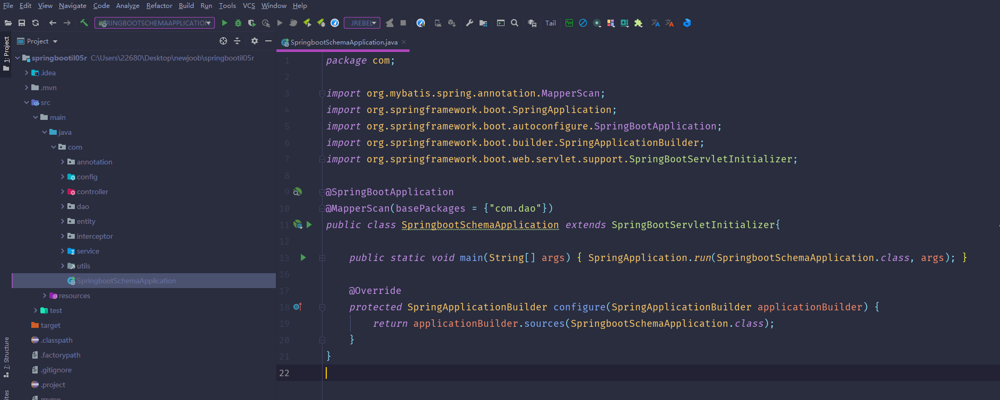

数据库表

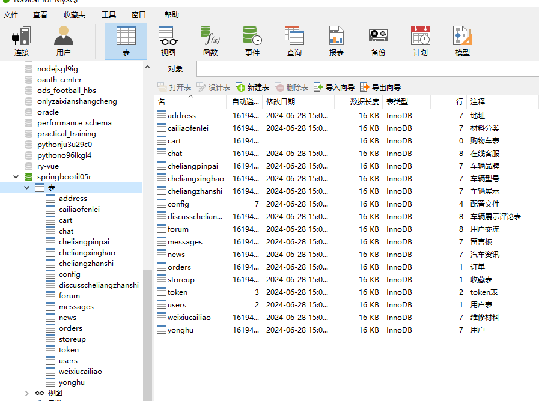

登录

用户端个人信息

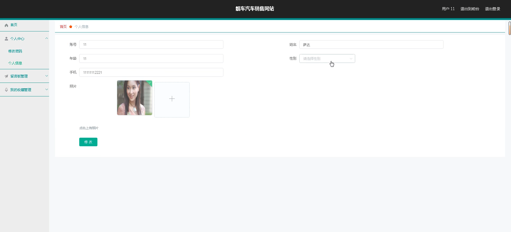

管理员端用户管理

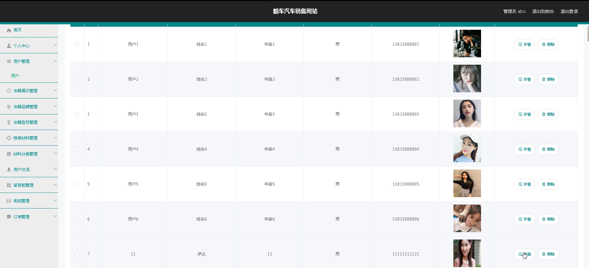

车辆品牌管理

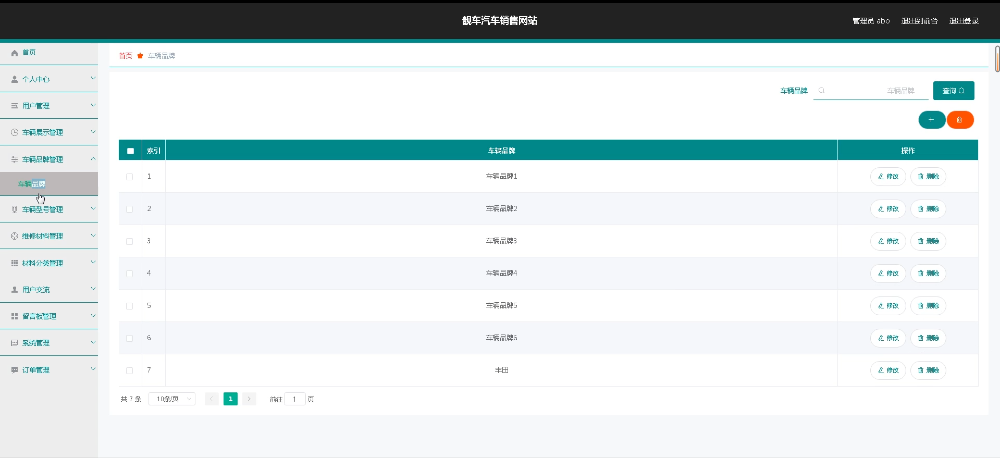

维修材料管理

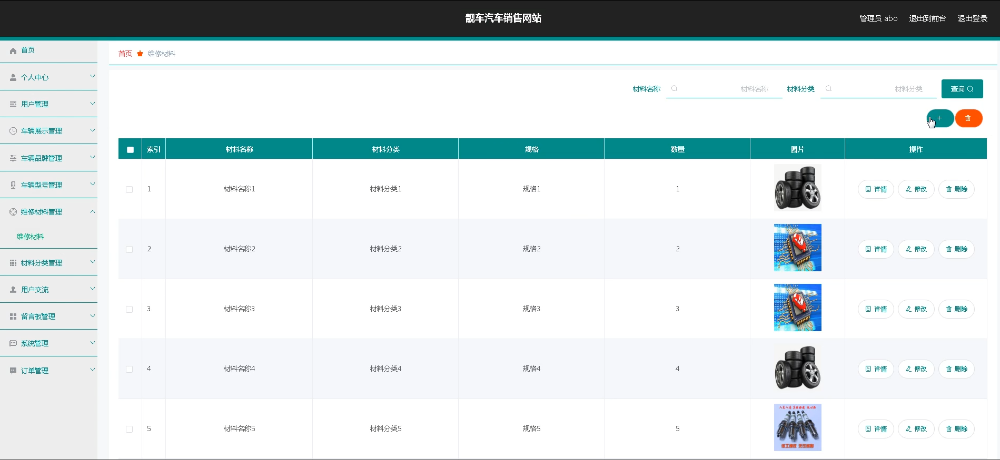

前台页面首页

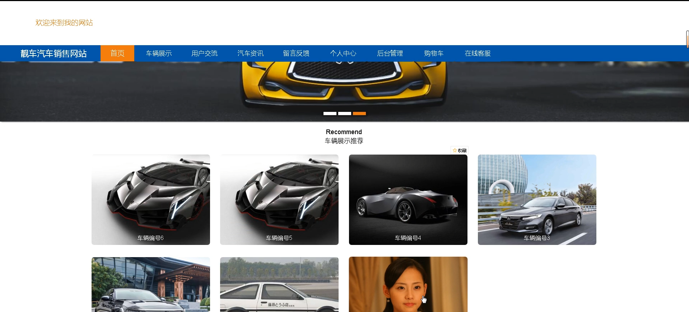

用户交流

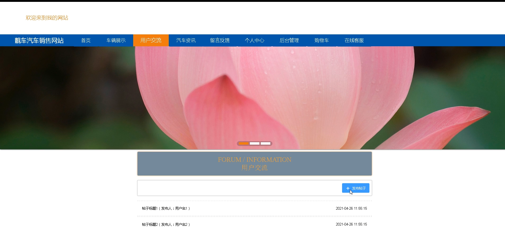

个人中心

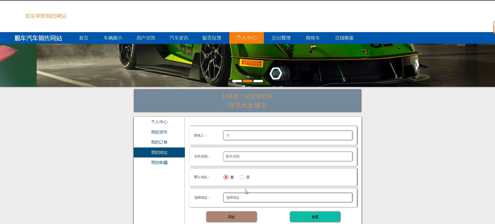

购物车

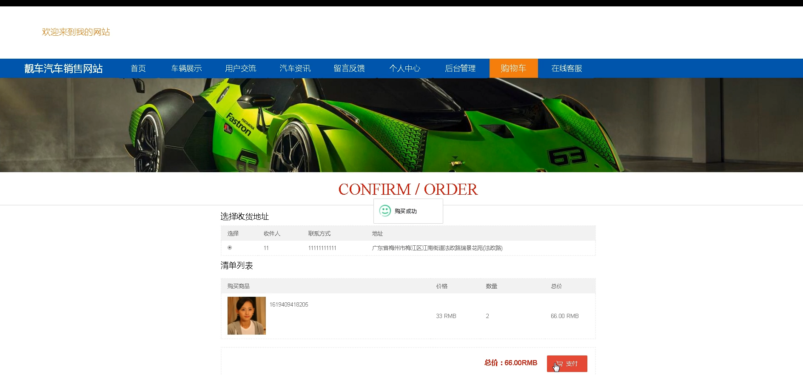

车辆展示评论

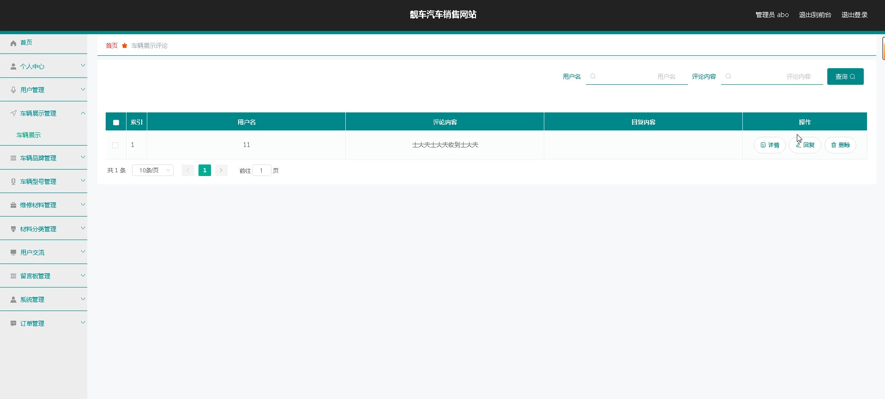

#### 总结

基于SpringBoot的靓车汽车销售网站通过角色分工和功能模块的设计，实现了用户与管理员的高效互动和信息管理。管理员通过系统维护和内容管理，确保网站的正常运行和信息的准确性；用户通过信息获取和互动交流，方便地浏览和购买车辆，提升了使用体验。该系统不仅优化了用户的购物流程，还提升了用户的满意度，为用户提供了一个便捷、高效的在线汽车交易平台。

#### 使用说明

创建数据库，执行数据库脚本 修改jdbc数据库连接参数 下载安装maven依赖jar 启动idea中的springboot项目

后台地址：http://localhost:8080/springbootil05r/admin/dist/index.html

管理员  abo 密码 abo

前台地址：http://localhost:8080/springbootil05r/front/index.html

